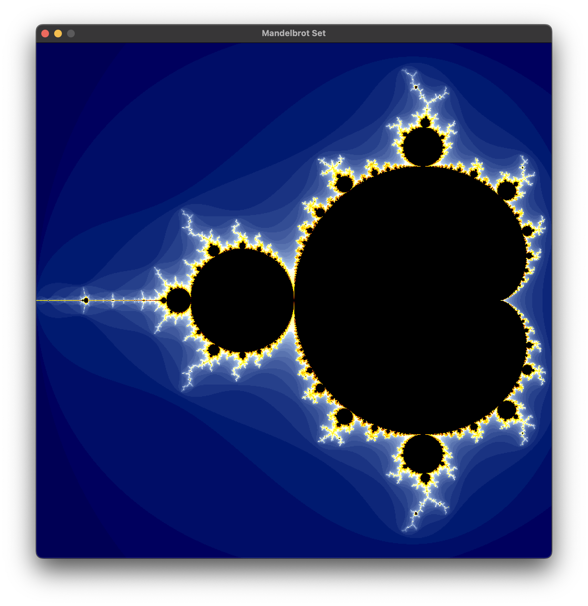
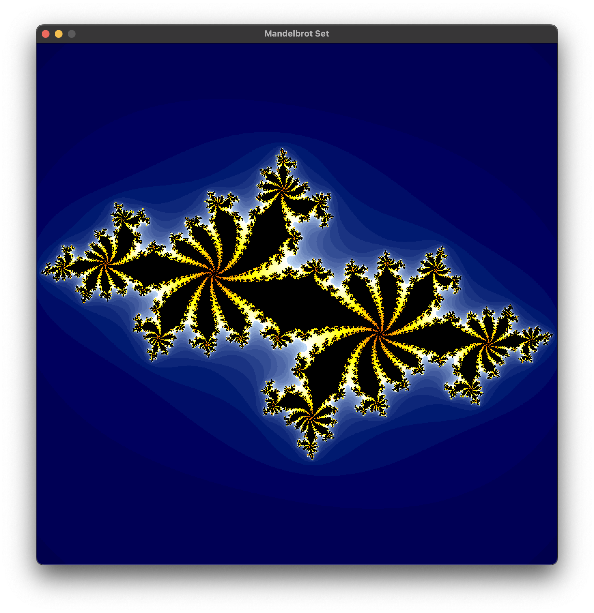
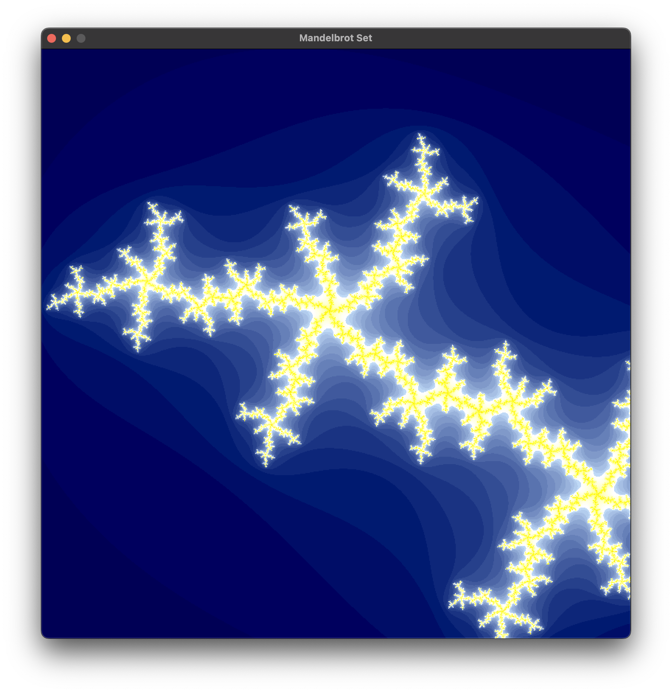
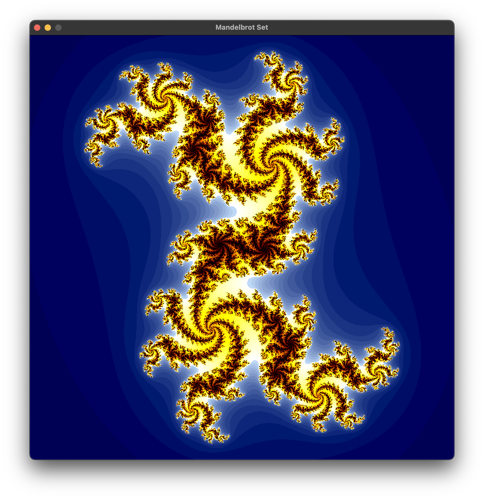
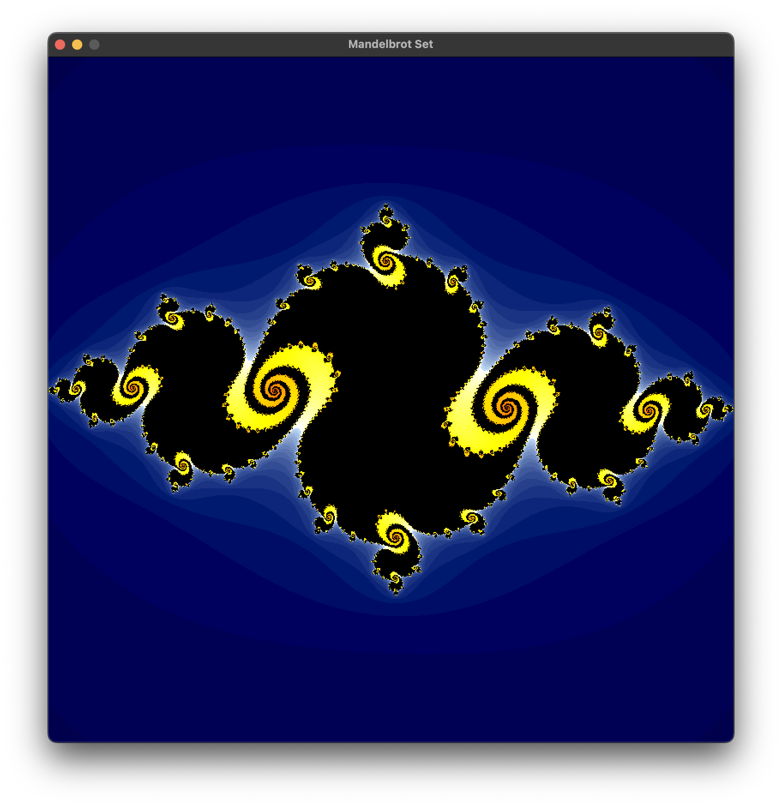

# Mandelbrot Set Plotter

This program plots the Mandelbrot set and Julia sets using OpenGL.

</img>

You can explore the set by moving the view around and zooming in and out.

</img>

Click any point on the Mandelbrot set to plot the Julia set for that point.

</img>
</img>
</img>
</img>

Author: Julian Koksal

Date: 2022-02-12

## How to build

Target platform is ARM64 MacOS with GLFW installed via homebrew.

`CXX_FLAGS` and `LD_LIBS` in the Makefile will need to be changed to build on other platforms.

### Dependencies

- OpenGL
- GLFW


### Configuration

`Constants.hpp` defines some configuration constants which can be adjusted to improve quality or increase performance.

### To build:

```
make
```

## How to use

### To run:

```
./Main
```
### Controls

Use the arrow keys to move the view around.

Use `x` to zoom in and `z` to zoom out.

Use `escape` to reset the view.

Left click on any point to plot the Julia set for that point. Left click again to plot the Mandelbrot set again.
